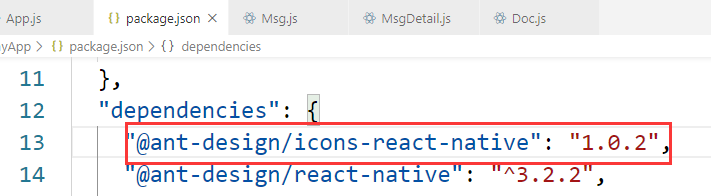

# react-native 步骤
### 安装
* `react-native init ProjectName`
* `adb connect 127.0.0.1:62001`
* `react-native run-android`

### 路由（Router）
* `yarn add react-native-router-flux@4.0.6`

### 图标（Icon）
* `yarn add @ant-design/react-native`
* 编辑package.json，添加：  

* `react-native link @ant-design/icons-react-native`

### 图标2（Icon）
* `yarn add react-native-vector-icons`  
* `react-native link react-native-vector-icons`
* `import Icon from 'react-native-vector-icons/FontAwesome';`

### react-native-button
* `yarn add react-native-button`

### react-native-message-bar
* `yarn add react-native-message-bar`

### react-native-swiper
* `yarn add react-native-swiper@nightly`

### WebView
* `yarn add react-native-webview`
* `react-native link react-native-webview`
* 在 android/gradle.properties  中添加 :  

```
android.useAndroidX=true
android.enableJetifier=true
```

### react-native-image-picker
* `yarn add react-native-image-picker`
* `react-native link react-native-image-picker`
* 在 项目\android\app\src\main\AndroidManifest.xml 添加:  

```
<uses-permission android:name="android.permission.CAMERA" />
<uses-permission android:name="android.permission.WRITE_EXTERNAL_STORAGE"/>
```
* 在 项目\android\app\src\main\java\com\项目名\MainActivity 中添加:  
开头添加：

```
import com.imagepicker.permissions.OnImagePickerPermissionsCallback; 
import com.facebook.react.modules.core.PermissionListener; 
```
MainActivity 中添加：`private PermissionListener listener;`

### react-native-image-crop-picker  
* `yarn add react-native-image-crop-picker`
* `react-native link react-native-image-crop-picker`
